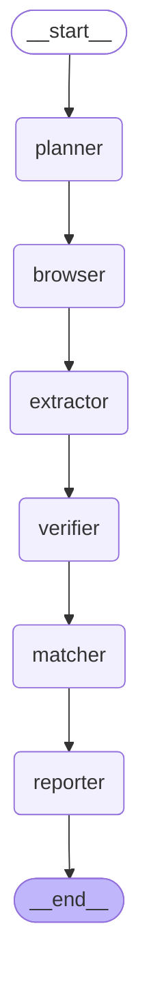

# LangGraph Agent 工作流

这个图展示 Web Task Agent 的 LangGraph 编排路径。

```mermaid
---
config:
  flowchart:
    curve: linear
---
graph TD;
	__start__([<p>__start__</p>]):::first
	planner(planner)
	browser(browser)
	extractor(extractor)
	verifier(verifier)
	matcher(matcher)
	reporter(reporter)
	__end__([<p>__end__</p>]):::last
	__start__ --> planner;
	browser --> extractor;
	extractor --> verifier;
	matcher --> reporter;
	planner --> browser;
	verifier --> matcher;
	reporter --> __end__;
	classDef default fill:#f2f0ff,line-height:1.2
	classDef first fill-opacity:0
	classDef last fill:#bfb6fc

```
