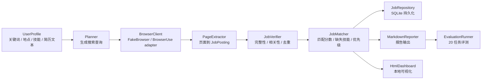

# Web 自动任务 Agent 项目展示材料

## 一句话介绍

这是一个面向 AI 工程 / AI 应用实习的 Web 自动任务 Agent。系统可以自动发现 AI 实习岗位，抽取结构化 JD，验证岗位有效性，结合用户技能和简历文本生成匹配分析，并输出 Markdown 报告、本地 HTML Dashboard 和 20 任务评测报告。

## 项目背景

普通的岗位搜索工具只能返回网页结果，不能稳定完成“搜索、阅读、抽取、判断、汇总、评测”这一整条任务链。本项目的目标是把求职场景拆成可观测的 Agent 工作流，让每一步都有明确输入输出，并能用测试和评测指标证明系统不是一次性的 prompt demo。

第一版没有直接把真实招聘网站作为评测主路径，而是先用 deterministic fake browser 打通端到端闭环。这是有意设计：真实网页会受登录、验证码、反爬和页面结构变化影响，过早接入会降低项目稳定性。当前版本已经提供 `browser-use` session adapter 入口，但演示和评测仍以可复现的 fake browser 为主。

## 核心能力

- Web 任务执行边界：通过 `BrowserClient` 抽象隔离 fake browser 和真实 `browser-use` session adapter。
- Agent 工作流：将任务拆成规划、浏览、抽取、验证、匹配、保存和报告生成。
- 结构化信息抽取：从页面内容中抽取岗位标题、公司、地点、技能、职责、发布时间和链接。
- 岗位有效性验证：根据置信度、JD 完整性、关键词相关性和重复规则过滤岗位。
- 简历匹配分析：根据用户技能标签和简历文本计算匹配分数、缺失技能、优先级和建议动作。
- 数据持久化：用 SQLite 保存岗位记录和运行指标。
- 可视化输出：生成 Markdown 报告和本地 HTML Dashboard。
- 可量化评测：内置 20 个任务配置和真实浏览器 smoke task，输出成功率、有效岗位数、平均访问页面数和失败原因分布。

## 架构概览



## 模块职责

| 模块 | 职责 | 面试可讲点 |
|---|---|---|
| `browser.py` | 定义浏览器客户端协议、fake browser 和 `browser-use` adapter | 通过接口隔离不稳定外部环境，保证测试可复现 |
| `models.py` | 定义 Pydantic 数据模型 | 对置信度、时间、指标做强校验，避免脏数据进入工作流 |
| `extractor.py` | 从页面内容抽取岗位结构 | 规则抽取可测试，未来可替换 LLM 抽取 |
| `verifier.py` | 验证岗位是否有效并去重 | 把 Agent 输出质量控制独立成模块 |
| `matcher.py` | 计算岗位与用户背景的匹配度 | 将求职场景从“找信息”升级为“决策辅助” |
| `storage.py` | SQLite 保存岗位和指标 | 支持后续评测、历史记录和可观测性 |
| `reporter.py` | 输出 Markdown 报告 | 让结果可读、可归档、可投递前复盘 |
| `dashboard.py` | 输出静态 HTML Dashboard | 面试演示更直观，不依赖前端服务 |
| `evaluation.py` | 运行 20 任务评测集 | 用指标证明 Agent 工作流稳定性 |
| `workflow.py` | 串联完整 Agent 流程 | 展示任务编排、状态流和模块解耦 |

## Agent 工作流

1. 用户输入岗位关键词、地点、目标数量、技能标签和可选简历文本。
2. Planner 生成多组搜索查询，例如通用查询、LangGraph/browser agent 查询、LLM agent 查询。
3. BrowserClient 返回候选页面。演示评测使用 fake browser；真实模式通过 `browser-use` session adapter 打开网页并读取标题和正文。
4. PageExtractor 将页面内容转成 `JobPosting`。
5. JobVerifier 过滤低置信度、无关、缺失 JD 或重复岗位。
6. JobMatcher 根据用户技能和简历文本计算匹配分数。
7. JobRepository 保存岗位和运行指标。
8. Reporter 和 Dashboard 生成可展示结果。
9. EvaluationRunner 批量运行任务并生成评测报告。

## 已验证指标

当前版本在内置 demo 页面上完成了确定性评测：

| 指标 | 结果 |
|---|---:|
| 自动化测试 | 83 passed |
| 评测任务数 | 20 |
| 完成任务数 | 20 |
| 任务成功率 | 1.00 |
| 有效岗位总数 | 40 |
| 平均访问页面数 | 2.00 |

这些指标代表确定性 MVP 闭环的稳定性，不代表真实招聘网站表现。真实网页接入后，需要重新构建真实网页评测集。

## 演示命令

```powershell
.\.venv\Scripts\web-task-agent.exe --keyword "AI intern" --location "Remote" --target-count 2 --skill Python --skill LangGraph --demo --dashboard
```

输出：

- `reports/*.md`：岗位报告和匹配分析。
- `dashboards/*.html`：本地 HTML Dashboard。
- `agent.db`：SQLite 岗位和运行指标。

评测命令：

```powershell
.\.venv\Scripts\web-task-agent.exe --evaluate --evaluation-count 20
```

输出：

- `evaluations/evaluation-report.md`：20 任务评测报告。

## 简历写法

推荐写法：

> 基于 Python 构建 Web 自动任务 Agent，实现 AI 实习岗位发现、结构化 JD 抽取、岗位有效性验证、简历匹配分析、SQLite 持久化和报告生成。设计 `BrowserClient` 抽象隔离 `browser-use` session adapter 与 deterministic fake browser，并将工作流拆分为 Planner、Browser、Extractor、Verifier、Matcher、Reporter、Dashboard 和 Evaluation 模块。构建 20 任务评测集，统计任务成功率、有效岗位数和平均访问页面数；当前 demo 评测中 20/20 任务完成，任务成功率 1.00。

如果简历空间更短：

> 构建 Web 自动任务 Agent，完成 AI 实习岗位搜索、JD 抽取、匹配分析和可视化报告；设计可测试的浏览器执行边界、20 任务评测集和真实浏览器 smoke 评测，输出任务成功率、有效岗位数、平均访问页面数和失败原因分布等指标。

## 面试讲述重点

### 为什么不用真实网页直接开做？

真实网页有登录、验证码、反爬和 DOM 变化问题。如果一开始就接真实网页，项目会变成调试网页自动化，而不是证明 Agent 工作流设计。因此先做 fake browser，保证抽取、验证、匹配、报告和评测链路稳定，再替换真实 adapter。

### 项目里哪里体现 Agent？

Agent 不只是调用 LLM，而是把开放任务拆成可恢复、可观测的状态流。本项目中，搜索计划、页面读取、信息抽取、结果验证、匹配分析、报告生成和评测统计都是独立节点，每个节点都有明确的数据契约。

### 项目里哪里体现工程能力？

- Pydantic 模型对时间、置信度、指标值做强校验。
- Fake browser 让端到端测试不依赖外部网页。
- SQLite 保存运行结果，便于复盘和评测。
- CLI、Markdown、HTML Dashboard 和评测报告构成完整可演示闭环。
- 83 个自动化测试覆盖模型、浏览器边界、抽取、验证、匹配、存储、报告、Dashboard、workflow、评测和失败分类。

## 当前限制

- 真实 `browser-use` session adapter 已接入，本地可打开搜索页并生成报告；评测报告已能统计 `browser_error`、`no_pages`、`no_extracted_jobs`、`verification_filtered` 等失败类别，但还没有针对招聘网站建立稳定站点评测集。
- 匹配模块目前是规则匹配，不是 LLM 语义匹配。
- Dashboard 是静态 HTML，不支持筛选、排序和交互式分析。
- 评测集使用内置 demo 页面，真实网页表现需要单独评估。

## 下一步路线

1. 为真实 `browser-use` 路径增加招聘网站白名单和真实招聘页面 fixture，让失败分类从 smoke 评测进入站点评测。
2. 引入 LLM 抽取器，并保留规则抽取作为 fallback。
3. 将匹配模块升级为语义匹配，支持项目经历、课程经历和岗位职责的细粒度对齐。
4. 增加真实网页评测集，统计成功率、失败原因、平均步骤数和耗时。
5. 将静态 Dashboard 升级为带筛选和排序的交互式页面。
