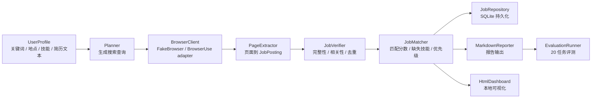

# Web 自动任务 Agent 项目展示材料

## 一句话介绍

这是一个面向 AI 工程 / AI 应用实习的 Web 自动任务 Agent。系统可以自动发现 AI 实习岗位，抽取结构化 JD，验证岗位有效性，结合用户技能和简历文本生成匹配分析，并输出 Markdown 报告、本地 HTML Dashboard、行动计划、输入轨迹和 20 任务评测报告；抽取层已提供可替换的 deterministic LLM demo 边界和 DeepSeek/Qwen OpenAI-compatible provider 边界。

## 项目背景

普通的岗位搜索工具只能返回网页结果，不能稳定完成“搜索、阅读、抽取、判断、汇总、评测”这一整条任务链。本项目的目标是把求职场景拆成可观测的 Agent 工作流，让每一步都有明确输入输出，并能用测试和评测指标证明系统不是一次性的 prompt demo。

第一版没有直接把真实招聘网站作为评测主路径，而是先用 deterministic fake browser 打通端到端闭环。这是有意设计：真实网页会受登录、验证码、反爬和页面结构变化影响，过早接入会降低项目稳定性。当前版本已经提供 `browser-use` session adapter 入口，但演示和评测仍以可复现的 fake browser 为主。

## 核心能力

- Web 任务执行边界：通过 `BrowserClient` 抽象隔离 fake browser 和真实 `browser-use` session adapter。
- Agent 工作流：将任务拆成规划、浏览、抽取、验证、匹配、保存和报告生成，并提供 sequential / LangGraph 两种编排模式、LangGraph 节点路径和 Agent 执行轨迹。
- 结构化信息抽取：从页面内容中抽取岗位标题、公司、地点、技能、职责、发布时间和链接，并提供可注入 LLM 风格抽取器 demo 与 DeepSeek/Qwen provider。
- 岗位有效性验证：根据置信度、JD 完整性、关键词相关性和重复规则过滤岗位。
- 简历匹配分析：根据用户技能标签和简历文本计算匹配分数、缺失技能、优先级和建议动作。
- 行动计划生成：根据匹配结果输出优先投递岗位、技能补强顺序、可展示项目任务、简历项目改写要点、7 天执行节奏，以及技术栈体验与面试说法。
- 数据持久化：用 SQLite 保存岗位记录和运行指标。
- 可视化输出：生成 Markdown 报告、本地岗位 HTML Dashboard、Agent 输入轨迹、Agent 执行轨迹和评测摘要 HTML Dashboard。
- 可量化评测：内置 20 个任务配置、公开招聘页风格 fixture 和真实浏览器 smoke task，输出成功率、有效岗位数、平均访问页面数和失败原因分布。

## 架构概览



## 模块职责

| 模块 | 职责 | 面试可讲点 |
|---|---|---|
| `browser.py` | 定义浏览器客户端协议、fake browser 和 `browser-use` adapter | 通过接口隔离不稳定外部环境，保证测试可复现 |
| `models.py` | 定义 Pydantic 数据模型 | 对置信度、时间、指标做强校验，避免脏数据进入工作流 |
| `extractor.py` | 从页面内容抽取岗位结构 | 规则抽取可测试，低置信度页面可接入 deterministic LLM demo 或真实 provider |
| `llm_extractor.py` | 定义 deterministic demo、DeepSeek/Qwen 配置和 OpenAI-compatible 抽取器 | 规则优先、低置信度触发、provider 可切换，避免把模型调用写死在抽取流程里 |
| `verifier.py` | 验证岗位是否有效并去重 | 把 Agent 输出质量控制独立成模块 |
| `matcher.py` | 计算岗位与用户背景的匹配度 | 将求职场景从“找信息”升级为“决策辅助” |
| `action_plan.py` | 根据匹配结果生成行动计划 | 将岗位匹配转化为可执行的补强任务 |
| `storage.py` | SQLite 保存岗位和指标 | 支持后续评测、历史记录和可观测性 |
| `reporter.py` | 输出 Markdown 报告 | 让结果可读、可归档、可投递前复盘 |
| `dashboard.py` | 输出静态 HTML Dashboard | 面试演示更直观，不依赖前端服务 |
| `evaluation.py` | 运行 20 任务评测集 | 用指标证明 Agent 工作流稳定性 |
| `workflow.py` | 串联完整 Agent 流程 | 展示任务编排、状态流和模块解耦 |

## Agent 工作流

1. 用户输入岗位关键词、地点、目标数量、技能标签和可选简历文本。
2. Planner 生成多组搜索查询，例如通用查询、LangGraph/browser agent 查询、LLM agent 查询。
3. BrowserClient 返回候选页面。演示评测使用 fake browser；真实模式通过 `browser-use` session adapter 打开网页并读取标题和正文。
4. PageExtractor 将页面内容转成 `JobPosting`。
5. JobVerifier 过滤低置信度、无关、缺失 JD 或重复岗位。
6. JobMatcher 根据用户技能和简历文本计算匹配分数。
7. JobRepository 保存岗位和运行指标。
8. Reporter 和 Dashboard 生成可展示结果。
9. EvaluationRunner 批量运行任务并生成评测报告。

## 已验证指标

当前版本在内置 demo 页面上完成了确定性评测：

| 指标 | 结果 |
|---|---:|
| 自动化测试 | ~160 passed |
| 评测任务数 | 20 |
| 完成任务数 | 20 |
| 任务成功率 | 1.00 |
| 有效岗位总数 | 40 |
| 平均访问页面数 | 2.00 |

### 真实站点 LLM 抽取器对比评测（8 个真实招聘 URL，覆盖 4 家公司）

所有 URL 均经 curl 逐个验证 HTTP 200 可访问，来源为 Greenhouse API 获取的真实岗位 ID：

| 公司 | URL 数 | 岗位示例 |
|---|---|---|
| Anthropic | 2 | Applied AI Claude Evangelist, TPM API Platform |
| ScaleAI | 3 | AI Builder Intern, AI Deployment Strategist, AI Strategy Consultant |
| Reddit | 2 | Analytics Engineer (Remote), Analytics Engineer (Toronto) |
| Discord | 1 | Director, Developer Solutions |

| Extractor | 完成 | 成功率 |
|---|---:|---:|
| baseline（规则） | 2/8 | 0.25 |
| llm-demo（确定性 demo） | 3/8 | 0.38 |
| deepseek（deepseek-v4-flash） | **7/8** | **0.88** |
| qwen（qwen-plus） | **7/8** | **0.88** |

**关键发现**：
- 两个主流 LLM provider（DeepSeek、Qwen）在 8 个真实招聘页上均达到 88% 完成率，是规则抽取的 3.5×，确定性 demo 的 2.3×
- DeepSeek 和 Qwen 结果一致（均为 7/8），表明 LLM 抽取的稳定性不依赖单一 provider——这验证了 provider 可替换架构的合理性
- 规则抽取在 Greenhouse 格式页面上只对带 "Title:" / "Requirements:" 标签的页面有效，多数真实页面没有这种标签
- 仅 1 个页面（Discord Director Developer Solutions）在所有 extractor 下都失败

### 语义匹配对比评测（7 个有效岗位，DeepSeek 匹配）

| 指标 | 结果 |
|---|---|
| 规则 vs DeepSeek 分数变化 | **4/7** (57%) |
| 规则匹配平均分 | 0.00 |
| DeepSeek 匹配平均分 | 0.08 |

规则匹配在真实页面上全打 0 分——Greenhouse 页面抽取的"技能"字段是原始需求文本而非关键词列表。DeepSeek 在 4/7 的岗位上发现了语义关联（如 `LangGraph` ↔ "Agentic AI"、`FastAPI` ↔ "back-end engineering"），验证了语义匹配在真实数据上的价值。

这些指标代表确定性 MVP 闭环的稳定性，不代表真实招聘网站表现。真实网页接入后，需要重新构建真实网页评测集。

## 演示命令

```powershell
.\.venv\Scripts\web-task-agent.exe --keyword "AI intern" --location "Remote" --target-count 2 --skill Python --skill LangGraph --demo --dashboard --action-plan --json-output outputs\result.json
.\.venv\Scripts\web-task-agent.exe --keyword "AI intern" --location "Remote" --target-count 2 --skill Python --skill LangGraph --demo --langgraph --dashboard
.\.venv\Scripts\web-task-agent.exe --keyword "AI intern" --target-count 2 --skill Python --skill LangGraph --demo --langgraph --dashboard --json-output outputs\langgraph-result.json
.\.venv\Scripts\web-task-agent.exe --seed-url "https://example.com/jobs/ai-engineering-intern" --demo --target-count 1 --json-output outputs\seed-demo.json
.\.venv\Scripts\web-task-agent.exe --seed-url "https://example.com/jobs/unstructured-ai-agent-intern" --demo --target-count 1 --llm-extractor-demo --json-output outputs\unstructured-llm-demo.json --dashboard
$env:DEEPSEEK_API_KEY="..."
.\.venv\Scripts\web-task-agent.exe --seed-url "https://example.com/jobs/unstructured-ai-agent-intern" --demo --target-count 1 --llm-extractor-provider deepseek --llm-extractor-model deepseek-v4-flash --json-output outputs\deepseek-llm-demo.json
$env:DASHSCOPE_API_KEY="..."
.\.venv\Scripts\web-task-agent.exe --seed-url "https://example.com/jobs/unstructured-ai-agent-intern" --demo --target-count 1 --llm-extractor-provider qwen --llm-extractor-model qwen-plus --json-output outputs\qwen-llm-demo.json
.\.venv\Scripts\web-task-agent.exe --compare-llm-extractor --json-output evaluations\llm-comparison.json
.\.venv\Scripts\web-task-agent.exe --compare-llm-extractor --seed-url "https://example.com/jobs/unstructured-ai-agent-intern" --seed-url "https://example.com/jobs/ai-engineering-intern" --json-output evaluations\seed-comparison.json
```

输出：

- `reports/*.md`：岗位报告、匹配分析、Agent 执行轨迹和面试讲述要点，并用相对 Markdown 链接列出行动计划、Dashboard 等相关产物。
- `action-plans/*.md`：优先投递岗位、技能补强顺序、项目任务、简历项目改写要点、7 天执行节奏和技术栈体验与面试说法。
- `dashboards/*.html`：本地 HTML Dashboard，会展示搜索 query、seed URL、URL 级错误、Agent 执行轨迹和行动计划等相关产物链接。
- `outputs/result.json`：一键闭环 demo 的机器可读完整 workflow state，包含报告路径、`metadata.orchestration_mode` 和 `metadata.execution_trace`；与行动计划和 Dashboard 同用时包含 `metadata.action_plan_path`、`metadata.dashboard_path` 和结构化 `metadata.top_action_gaps`。
- `outputs/langgraph-result.json`：LangGraph 编排路径的 workflow state，用于和默认 sequential 编排结果对比。
- `outputs/seed-demo.json`：跳过搜索、直接打开指定 JD 的机器可读 workflow state。
- `outputs/unstructured-llm-demo.json`：deterministic LLM demo 抽取低结构化 JD 后的 workflow state。
- `outputs/deepseek-llm-demo.json` / `outputs/qwen-llm-demo.json`：外部 provider 抽取低结构化 JD 后的 workflow state，metadata 会记录 provider 和 model。
- `evaluations/llm-comparison.json` / `evaluations/seed-comparison.json`：规则抽取、LLM demo 和可选真实 provider 在同一批 seed URL 上的对比结果。
- `evaluations/llm-extractor-comparison.md`：LLM 抽取器对比评测 Markdown 报告，按 extractor 汇总任务数、完成数、成功率、有效岗位和失败原因。
- `--real-site-sample`：真实站点样本模式，配合 `--evaluate` 或 `--compare-llm-extractor` 使用，走固定真实 URL 样本并通过 HTTP loader 读取正文；8 样本正式 benchmark 已验证 DeepSeek 88% 完成率，并把 verifier 过滤原因回填到 JSON 与报告里。
- `agent.db`：SQLite 岗位和运行指标。
- `--history`：从 SQLite 打印最近运行记录。
- `--print-demo-script`：输出面试现场可复制的演示命令清单。

评测命令：

```powershell
.\.venv\Scripts\web-task-agent.exe --evaluate --evaluation-count 20
.\.venv\Scripts\web-task-agent.exe --evaluate --fixture-sites --seed-url "https://boards.greenhouse.io/example/jobs/ai-agent-intern" --json-output evaluations\seed-url-result.json
.\.venv\Scripts\web-task-agent.exe --evaluate --seed-url "https://example.com/jobs/unstructured-ai-agent-intern" --llm-extractor-demo --json-output evaluations\unstructured-llm-result.json
```

输出：

- `evaluations/evaluation-report.md`：20 任务评测报告。
- `evaluations/fixture-result.json`：机器可读的评测摘要和任务明细。
- `evaluations/seed-url-result.json`：单个 exact JD 的稳定评测结果。
- `evaluations/unstructured-llm-result.json`：低结构化 JD 的 deterministic LLM demo 评测结果。
- `dashboards/evaluation-summary.html`：加 `--dashboard` 后生成的评测摘要页面。
- `docs/agent-workflow-graph.md`：通过 `--export-graph` 生成的 LangGraph Mermaid 工作流图。

## 简历写法

推荐写法：

> 基于 Python 构建 Web 自动任务 Agent，实现 AI 实习岗位发现、指定 JD 打开、结构化 JD 抽取、岗位有效性验证、简历匹配分析、行动计划生成、SQLite 持久化和报告生成。设计 `BrowserClient` 抽象隔离 `browser-use` session adapter 与 deterministic fake browser，并将工作流拆分为 Planner、Browser、Extractor、Verifier、Matcher、Reporter、Dashboard 和 Evaluation 模块；提供 LangGraph 节点编排路径，并为低置信度页面提供 deterministic LLM demo 和 DeepSeek/Qwen OpenAI-compatible 抽取边界。构建 20 任务评测集，统计任务成功率、有效岗位数和平均访问页面数；当前 demo 评测中 20/20 任务完成，任务成功率 1.00。

如果简历空间更短：

> 构建 Web 自动任务 Agent，完成 AI 实习岗位搜索、指定 JD 打开、JD 抽取、匹配分析和可视化报告；设计可测试的浏览器执行边界、20 任务评测集、公开招聘页 fixture、seed URL 评测和真实浏览器 smoke 评测，输出任务成功率、有效岗位数、平均访问页面数、失败原因分布和 URL 级错误明细等指标。

## 面试讲述重点

### 为什么不用真实网页直接开做？

真实网页有登录、验证码、反爬和 DOM 变化问题。如果一开始就接真实网页，项目会变成调试网页自动化，而不是证明 Agent 工作流设计。因此先做 fake browser，保证抽取、验证、匹配、报告和评测链路稳定，再替换真实 adapter。

### 项目里哪里体现 Agent？

Agent 不只是调用 LLM，而是把开放任务拆成可恢复、可观测的状态流。本项目中，搜索计划、页面读取、信息抽取、结果验证、匹配分析、报告生成和评测统计都是独立节点，每个节点都有明确的数据契约；同一组节点可以 sequential 方式运行，也可以通过 LangGraph 编排运行，报告和 JSON 会记录编排模式与每个节点的执行摘要，方便面试现场解释工作流不是黑盒。

### 项目里哪里体现工程能力？

- Pydantic 模型对时间、置信度、指标值做强校验。
- Fake browser 让端到端测试不依赖外部网页。
- LLM 抽取边界通过 provider 配置、环境变量和 JSON/Pydantic 校验接入，测试使用 fake transport，不依赖真实 API key；`--compare-llm-extractor` 可把规则抽取、demo 抽取和 provider 抽取放到同一批 seed URL 上比较。
- SQLite 保存运行结果，便于复盘和评测。
- CLI、Markdown、HTML Dashboard 和评测报告构成完整可演示闭环。
- Markdown 报告会沉淀面试讲述要点，把 BrowserClient 边界、编排模式、Agent 执行轨迹和评测闭环直接转成可讲项目叙事。
- 144 个自动化测试覆盖模型、浏览器边界、规则抽取、LLM demo 抽取边界、LLM demo 对比评测、验证、匹配、行动计划、行动缺口 CLI 摘要、简历项目改写要点、7 天执行节奏、技能缺口汇总、简历输入、seed URL、JSON 导出、Agent 执行轨迹、编排模式记录、面试讲述要点、评测 JSON 导出、LLM demo 评测路径、运行历史、CLI 版本入口、环境自检、虚拟环境状态检查、fixture URL 列表、demo script、存储、报告、报告产物相对链接、Dashboard 交互、Dashboard 产物链接与相对路径、Dashboard 执行轨迹、输入轨迹、workflow、LangGraph 编排、图导出、公开招聘页 fixture、失败分类和 URL 级错误明细。

## 当前限制

- 真实 `browser-use` session adapter 已接入，`HttpPageLoader` 用于抓取真实 URL；评测报告已能细分 HTTP 失败的根因：`http_timeout`（DNS/连接超时）、`http_error`（HTTP 4xx/5xx）、`empty_page`（JS 渲染页面无正文）、`browser_error`（其他）。当前 8 个 URL 全部正常可访问，HTTP-level 错误分类通过 mock 测试验证。
- LLM 抽取器已提供 deterministic demo、DeepSeek 和 Qwen provider，评测数据：DeepSeek 7/8 (88%)、Qwen 7/8 (88%)。
- 匹配模块已升级为两层架构：规则优先 + LLM 语义 fallback；语义匹配批量评测：规则全 0 分（技能字段为原始文本），DeepSeek 4/7 发现语义关联。
- Dashboard 是静态 HTML，已支持筛选、排序、输入轨迹和 Agent 执行轨迹展示。
- 真实站点评测集目前有 8 个 URL（4 家公司：Anthropic、ScaleAI、Reddit、Discord），经 curl 逐个验证可访问。

## 下一步路线

1. 扩展真实站点样本库，增加更多 Greenhouse/Lever/Workday 格式的招聘 URL。
2. 将语义匹配的批量评测扩展为多用户画像对比（不同技能组合 vs 同一批岗位）。
3. 可选：接入 Playwright 做 JS 渲染页面的视觉内容抓取。
3. 将语义匹配升级为批量评测模式：同一批岗位分别跑规则匹配和 LLM 匹配，人工标注匹配质量。
4. 可选：增加 `--llm-match-min-score` 参数，允许用户自定义阈值。
